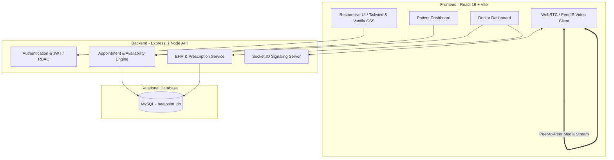
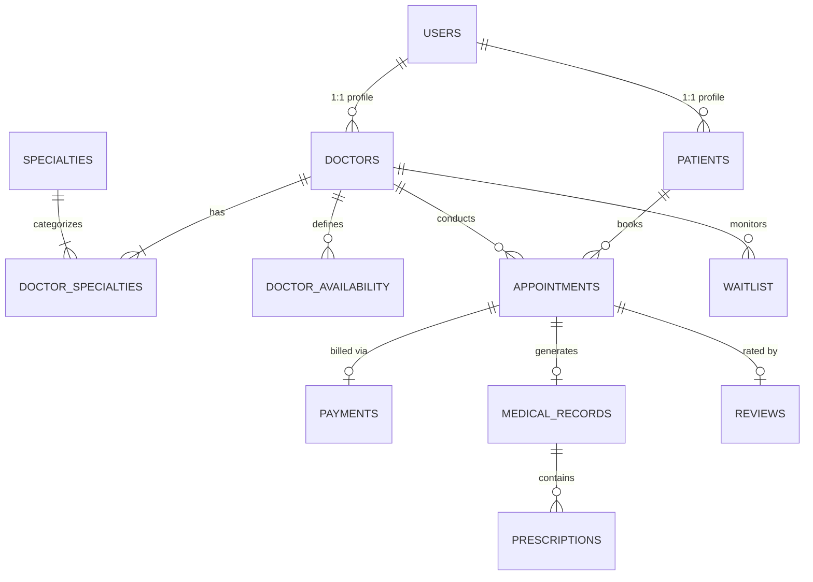
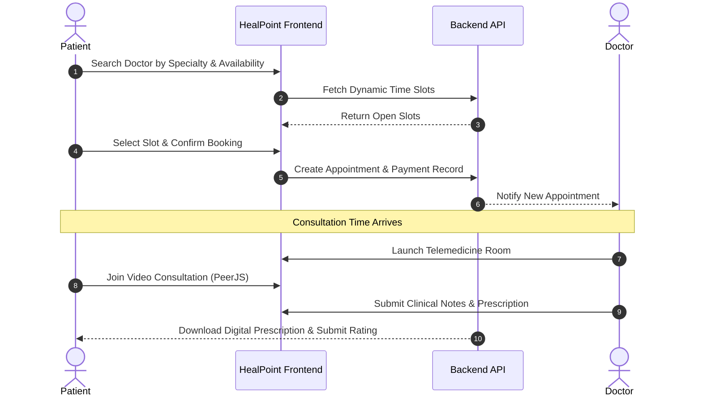

# 🩺 HealPoint — Modern Doctor Appointment & Telemedicine Platform
> **Presentation-Ready Project Documentation & Slide-by-Slide Guide**

[](https://react.dev/)
[](https://expressjs.com/)
[](https://www.mysql.com/)
[](https://peerjs.com/)
[](LICENSE)

---

## 📑 Table of Contents
1. [Executive Summary](#-executive-summary)
2. [Slide-by-Slide Presentation Structure](#-slide-by-slide-presentation-structure)
   - [Slide 1: Title & Project Overview](#slide-1-title--project-overview)
   - [Slide 2: Problem Statement & Healthcare Challenges](#slide-2-problem-statement--healthcare-challenges)
   - [Slide 3: Proposed Solution & Core Value Propositions](#slide-3-proposed-solution--core-value-propositions)
   - [Slide 4: Key Actors & Role-Based Access Control (RBAC)](#slide-4-key-actors--role-based-access-control-rbac)
   - [Slide 5: Core Features & System Capabilities](#slide-5-core-features--system-capabilities)
   - [Slide 6: System Architecture & Data Flow](#slide-6-system-architecture--data-flow)
   - [Slide 7: Database Architecture & Schema Design](#slide-7-database-architecture--schema-design)
   - [Slide 8: End-to-End User Journey (Booking to Consultation)](#slide-8-end-to-end-user-journey-booking-to-consultation)
   - [Slide 9: Real-Time Telemedicine Engine](#slide-9-real-time-telemedicine-engine)
   - [Slide 10: Security, Privacy & Data Integrity](#slide-10-security-privacy--data-integrity)
   - [Slide 11: Technology Stack Breakdown](#slide-11-technology-stack-breakdown)
   - [Slide 12: Future Scope & Roadmap](#slide-12-future-scope--roadmap)
   - [Slide 13: Conclusion & Q&A](#slide-13-conclusion--qa)
3. [Quickstart & Local Setup Guide](#-quickstart--local-setup-guide)
4. [Speaker Notes & Presentation Tips](#-speaker-notes--presentation-tips)

---

## 🌟 Executive Summary

**HealPoint** is a full-stack, enterprise-grade healthcare management and telemedicine web application. It bridges the gap between healthcare providers and patients by streamlining doctor discovery, automated appointment scheduling, synchronized calendar availability, interactive video consultations (WebRTC), digital medical records (EHR), and automated notifications.

---

# 📊 Slide-by-Slide Presentation Structure

Use the sections below as direct content for your PowerPoint slides and presenter notes.

---

### Slide 1: Title & Project Overview
* **Slide Title:** HealPoint: Next-Generation Doctor Appointment & Telemedicine Platform
* **Subtitle:** Seamless Healthcare Booking, Virtual Consultations, and Patient Management
* **Key Visuals:** Project logo, mockups of the landing page, and dashboard previews.
* **Bullet Points:**
  - **Vision:** Accessible, frictionless healthcare connecting patients and top medical professionals anytime, anywhere.
  - **Platform Type:** Responsive Web Application (SPA) with Real-Time Video & Data Synchronization.
  - **Target Audience:** Patients seeking flexible medical care, specialized doctors managing practices, and healthcare clinic administrators.
* **🗣️ Speaker Notes:**
  > *"Good morning/afternoon everyone. Today, I am excited to present **HealPoint**, a modern healthcare platform designed to solve the friction in traditional clinical appointment booking and remote telemedicine consultations. Our goal is to provide a seamless digital front door for modern medical care."*

---

### Slide 2: Problem Statement & Healthcare Challenges
* **Slide Title:** Challenges in Traditional Healthcare Scheduling
* **Key Visuals:** Comparison graphic showing Long Wait Times vs. Instant Digital Booking.
* **Bullet Points:**
  - ⏳ **High Wait Times & Bottlenecks:** Physical queueing and manual phone reservations cause scheduling delays and overhead.
  - 📉 **High No-Show Rates:** Lack of automated reminders and flexible rescheduling leads to lost clinical revenue.
  - 🌐 **Geographical Barriers:** Patients in remote or underserved areas struggle to access specialized doctors.
  - 📁 **Fragmented Health Records:** Prescriptions and medical histories scattered across physical paper files.
  - ❌ **Double Booking & Inflexible Availability:** Rigid doctor schedules with no dynamic slot generation or waitlist management.
* **🗣️ Speaker Notes:**
  > *"Traditional healthcare systems are plagued by operational bottlenecks. Patients wait days for appointments and spend hours in waiting rooms. Clinics suffer high no-show rates, while doctors lack unified tools to manage their schedule, video consultations, and prescriptions in one place. HealPoint directly targets these pain points."*

---

### Slide 3: Proposed Solution & Core Value Propositions
* **Slide Title:** The HealPoint Solution: An Integrated Digital Ecosystem
* **Key Visuals:** 3-Pillar diagram: Patients ↔ Platform ↔ Doctors.
* **Bullet Points:**
  - ⚡ **Instant & Intelligent Booking:** Real-time doctor search by specialty, rating, fee, and dynamic 30-minute slot availability.
  - 📹 **Integrated WebRTC Telemedicine:** High-definition, low-latency video consultations directly in the browser without third-party downloads.
  - 📋 **Centralized Electronic Health Records (EHR):** Digital prescription authoring, clinical notes history, and past consultation logs.
  - 🔔 **Proactive Notifications & Waitlists:** Automated status alerts, cancellation handling, and waitlist fulfillment.
  - 💳 **Transparent Billing & Insurance:** Support for direct fee payments, co-pay workflows, and cancellation refunds.
* **🗣️ Speaker Notes:**
  > *"HealPoint offers an all-in-one digital ecosystem. Instead of juggling separate tools for video calls, calendar invites, and paperwork, both patients and physicians have a purpose-built workspace tailored to their specific needs."*

---

### Slide 4: Key Actors & Role-Based Access Control (RBAC)
* **Slide Title:** User Personas & System Access Control
* **Key Visuals:** 3 Persona cards: Patient, Doctor, Admin.

| Role | Key Capabilities & Workflows |
| :--- | :--- |
| 🧑‍🦱 **Patient** | • Browse doctors by specialty, location, and fees.<br>• Book/reschedule appointments in real-time.<br>• Join secure WebRTC telemedicine calls.<br>• Access prescriptions, medical records, and submit reviews.<br>• Manage insurance details and join doctor waitlists. |
| 👨‍⚕️ **Doctor** | • Manage weekly recurring and date-specific availability.<br>• View today's & upcoming appointments roster.<br>• Launch and conduct remote video consultations.<br>• Issue digital prescriptions & clinical notes.<br>• Track patient histories and consultation fees. |
| 🛡️ **Administrator** | • Doctor credential verification & onboarding approval.<br>• Platform analytics, revenue reports, and user governance.<br>• System-wide specialty and category management. |

* **🗣️ Speaker Notes:**
  > *"Security and role boundaries are paramount in healthcare. HealPoint implements strict Role-Based Access Control dividing the platform into three intuitive interfaces: the Patient Portal, the Physician Dashboard, and the Administrative Control Hub."*

---

### Slide 5: Core Features & System Capabilities
* **Slide Title:** Comprehensive Feature Breakdown
* **Key Visuals:** Feature grid with icons.
* **Bullet Points:**
  - 🔍 **Doctor Discovery Engine:** Filter by medical specialty (Cardiology, Dermatology, Neurology, Pediatrics, etc.), minimum rating, and consultation budget.
  - 📅 **Dynamic Slot Generator:** Intelligent calculation of available 30-minute consultation slots based on physician working hours and booked slots.
  - 📹 **Browser-Based Telemedicine:** One-click instant video room creation with real-time peer-to-peer audio/video streaming.
  - 💊 **Digital Prescription Suite:** Doctors create structured digital prescriptions with medicine name, dosage, and intake instructions tied directly to patient history.
  - ⭐ **Patient Feedback & Rating System:** Verified review system (1 to 5 stars with written feedback) ensuring healthcare transparency.
  - ⏳ **Smart Waitlist Management:** Automatically alerts waiting patients when earlier slots become available due to cancellations.
* **🗣️ Speaker Notes:**
  > *"Every feature is engineered for convenience. The dynamic slot generator eliminates double-booking, while the integrated prescription builder ensures patients leave virtual consultations with actionable medical documentation."*

---

### Slide 6: System Architecture & Data Flow
* **Slide Title:** High-Level Architecture & Technical Flow
* **Key Visuals:** Architecture Diagram (Mermaid).



* **🗣️ Speaker Notes:**
  > *"HealPoint uses a decoupled client-server architecture. The frontend is built on React 19 and Vite for fast rendering and high responsiveness. The Express.js backend handles business logic and validation, backed by MySQL for relational integrity. For video, WebRTC establishes direct peer-to-peer media streams with Socket.IO handling signaling."*

---

### Slide 7: Database Architecture & Schema Design
* **Slide Title:** Relational Schema & Entity Relationships (`healpoint_db`)
* **Key Visuals:** Database ERD summary table.



* **Key Entities & Attributes:**
  - **`users`**: Base identity store with email, password hash, role (`ADMIN`, `DOCTOR`, `PATIENT`), timestamps.
  - **`doctors` / `patients`**: Extended profile models with biographical info, fees, contact details.
  - **`doctor_availability`**: Day of week / specific dates, time windows, and slot duration.
  - **`appointments`**: Datetime, status (`SCHEDULED`, `COMPLETED`, `CANCELLED`, `NO_SHOW`), telemedicine room URL.
  - **`medical_records` & `prescriptions`**: Diagnosis notes, dosage, medication name, and instructions.
  - **`payments` & `patient_insurance`**: Transaction references, co-pay tracking, and refund tracking.
* **🗣️ Speaker Notes:**
  > *"The database is structured to enforce strong referential integrity with cascading deletes and strict enum constraints, ensuring audit-compliant tracking of medical records, payment transactions, and appointment histories."*

---

### Slide 8: End-to-End User Journey (Booking to Consultation)
* **Slide Title:** Step-by-Step Patient & Doctor Workflow
* **Key Visuals:** Linear process flow diagram.



* **🗣️ Speaker Notes:**
  > *"Here is the complete journey: From initial discovery and slot selection to the video consultation and digital prescription delivery, the entire experience happens inside a single, unified flow without external friction."*

---

### Slide 9: Real-Time Telemedicine Engine
* **Slide Title:** In-Browser Telemedicine Powered by WebRTC & PeerJS
* **Key Visuals:** Dual-video call mockup with controls (Mute, Camera toggle, Screen share, End call).
* **Bullet Points:**
  - 🔒 **End-to-End Peer-to-Peer Encryption:** Direct audio/video transmission between patient and physician browsers.
  - ⚡ **Zero-Install Experience:** Works natively on modern desktop and mobile web browsers.
  - 🔄 **Real-Time Signaling:** Socket.IO handles handshake negotiation, room access validation, and participant connection states.
  - 🎛️ **In-Call Controls:** Real-time audio mute/unmute, video stream toggle, and secure session termination.
* **🗣️ Speaker Notes:**
  > *"Telemedicine should be as simple as clicking a link. By utilizing WebRTC and PeerJS, we achieve ultra-low latency audio/video streaming without requiring patients to install bulky third-party apps like Zoom or Teams."*

---

### Slide 10: Security, Privacy & Data Integrity
* **Slide Title:** Security, Privacy & Healthcare Compliance
* **Key Visuals:** Shield and security lock badges.
* **Bullet Points:**
  - 🔐 **Authentication & Authorization:** Secure password hashing (bcrypt) and protected session/token validation.
  - 🛡️ **Role-Based Route Protection:** Separate access boundaries preventing unauthorized patient-doctor record access.
  - 🗄️ **Data Integrity & Relational Isolation:** Cascade rules preventing orphaned records and strict foreign-key verification.
  - 🔒 **HIPAA/GDPR Alignment Principles:** Patient data confidentiality, secure video session channels, and auditable medical logs.
* **🗣️ Speaker Notes:**
  > *"Healthcare applications demand uncompromising security. HealPoint is built with privacy-by-design, role separation, and cryptographic password safeguards to ensure all patient consultations and histories remain strictly confidential."*

---

### Slide 11: Technology Stack Breakdown
* **Slide Title:** Modern & Scalable Technology Stack
* **Key Visuals:** Tech logos grid (React, Node, Express, MySQL, Vite, WebRTC).

```
┌─────────────────────────────────────────────────────────────┐
│                       HEALPOINT TECH STACK                  │
├───────────────────┬─────────────────────────────────────────┤
│ Frontend          │ React 19, Vite, Modern CSS3, HTML5      │
├───────────────────┼─────────────────────────────────────────┤
│ Networking & API  │ Axios, RESTful Endpoints                │
├───────────────────┼─────────────────────────────────────────┤
│ Real-Time / Video │ PeerJS, WebRTC, Socket.io-client        │
├───────────────────┼─────────────────────────────────────────┤
│ Backend Runtime   │ Node.js, Express.js                     │
├───────────────────┼─────────────────────────────────────────┤
│ Database          │ MySQL 8.0 (Structured Relational Schema)│
├───────────────────┼─────────────────────────────────────────┤
│ Code Quality      │ Oxlint, Modular ES Modules              │
└───────────────────┴─────────────────────────────────────────┘
```

* **🗣️ Speaker Notes:**
  > *"Our stack was selected for performance, maintainability, and responsiveness. React 19 with Vite delivers lightning-fast hot reloads and optimized production builds, while Express and MySQL provide rock-solid backend throughput."*

---

### Slide 12: Future Scope & Roadmap
* **Slide Title:** Future Roadmap & Innovation Opportunities
* **Key Visuals:** Roadmap timeline (Phase 1, Phase 2, Phase 3).
* **Bullet Points:**
  - 🤖 **AI-Powered Symptom Checker & Triage:** Machine learning assistant to suggest relevant medical specialties before booking.
  - 📱 **Native Mobile Apps:** Cross-platform iOS & Android apps built with React Native / Expo.
  - 💬 **WhatsApp & SMS Bot Integration:** Automated appointment reminders, booking confirmations, and instant prescription delivery.
  - 💳 **Direct Insurance Claim Clearance:** Automated API integration with major health insurance providers for instant eligibility verification.
  - ⌚ **IoT & Wearables Integration:** Syncing patient vitals (heart rate, blood pressure, glucose levels) with the physician dashboard.
* **🗣️ Speaker Notes:**
  > *"Looking ahead, HealPoint has massive potential for scaling. Next phases include AI-driven symptom triaging, WhatsApp automated reminders, and wearable device integration for real-time vitals tracking during telemedicine calls."*

---

### Slide 13: Conclusion & Q&A
* **Slide Title:** HealPoint — Empowering Smarter Healthcare
* **Bullet Points:**
  - ✅ Solves real-world healthcare scheduling and accessibility barriers.
  - ✅ Modern, full-stack architecture with zero third-party video call dependencies.
  - ✅ Robust, scalable, and modular design ready for production expansion.
  - ❓ **Questions & Answers:** Open floor for technical and functional queries.
* **🗣️ Speaker Notes:**
  > *"In conclusion, HealPoint transforms how patients connect with doctors and how doctors manage their practice. Thank you for your time, and I welcome any questions you may have about the project!"*

---

# 🚀 Quickstart & Local Setup Guide

Follow these steps to run the application locally for your live demonstration:

### 1. Clone & Prerequisites
- Node.js (v18+ recommended)
- MySQL Server (v8.0+)
- npm or yarn

### 2. Database Setup
1. Open your MySQL client (Workbench, phpMyAdmin, or CLI).
2. Execute the initialization script:
   ```sql
   SOURCE Healpoint_db.sql;
   ```
   *(This creates `healpoint_db` and all 11 required tables with constraints).*

### 3. Backend Setup (Express.js)
```bash
cd ExpressJs
npm install
npm run dev # Or node index.js / nodemon
```
*Backend runs by default on `http://localhost:3001`*

### 4. Frontend Setup (React + Vite)
```bash
cd React
npm install
npm run dev
```
*Frontend runs by default on `http://localhost:5173`*

---

# 💡 Speaker Notes & Presentation Tips

1. **Live Demo Strategy:**
   - Start at the **Homepage** to showcase clean design and instant doctor search.
   - Show the **Patient View**: filter by specialty, pick a slot, and book an appointment.
   - Switch to the **Doctor Dashboard**: show the newly populated appointment on the schedule.
   - Demonstrate the **WebRTC Call**: open two browser windows (Doctor + Patient) to demonstrate live video streaming.
   - Show the **Digital Prescription** generation and rating submission.
2. **Key Technical Strengths to Highlight:**
   - Real-time peer-to-peer WebRTC video with no external paid services.
   - Dynamic 30-minute slot generation handling schedule collisions.
   - Clean relational schema design preventing duplicate bookings.

---
*Created for HealPoint Project Demonstration & Technical Presentations.*
